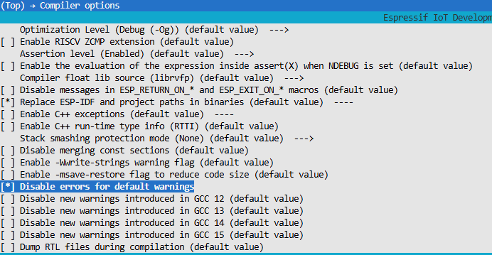
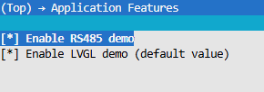

# ZX2D80CE63S-V10

[English](./readme.md)

## 简介

ZX2D80CE63S-V10 是一个基于 ESP-IDF 的参考工程，用于驱动 ZX2D80CE63S-V10 硬件平台上的显示、触控和可选 RS485 功能。工程默认集成以下软件栈：

- ESP-IDF v6.0.1
- LVGL 9.x
- ST7789 LCD 驱动
- FT5x06 触控驱动

该工程适合作为以下场景的起点：

- 快速验证 LCD 和触控硬件是否正常工作
- 作为 LVGL 图形界面项目的初始化模板
- 在现有应用中复用显示、触控和 RS485 的板级初始化代码

## 功能特性

- 支持 240 x 320 分辨率 SPI 屏幕显示
- 集成 FT5x06 电容触控输入
- 支持 LVGL 图形界面和示例界面启动
- 支持通过 menuconfig 按需启用或关闭 RS485 示例
- 使用 managed components 管理图形与外设相关依赖

## 依赖环境

建议使用以下环境组合：

- ESP-IDF v6.0.1
- 已完成 ESP-IDF 工具链安装与环境导出
- 目标芯片：esp32c61

工程依赖在 [main/idf_component.yml](main/idf_component.yml) 中声明，主要包括：

- lvgl/lvgl 9.x
- jbrilha/esp_lcd_st7789
- espressif/esp_lcd_touch_ft5x06

## 快速开始

### 1. 设置目标芯片

```bash
idf.py set-target esp32c61
```

### 2. 打开配置菜单

```bash
idf.py menuconfig
```

### 3. 调整编译选项

当前 LVGL 相关示例在默认编译选项下可能触发警告并被视为错误。若出现此类构建失败，请在 menuconfig 中启用以下选项：

```bash
Compiler options -> Disable errors for default warnings
```

<div style="text-align: center;">
     
</div>

### 4. 选择应用功能

可在以下路径中启用或关闭应用功能：

```bash
(Top) -> Application Features
```

可配置项包括：

- Enable RS485 demo：启动 RS485 示例任务
- Enable LVGL demo：初始化 LCD、触控和 LVGL 示例界面

对应配置定义位于 [main/Kconfig.projbuild](main/Kconfig.projbuild)。

<div style="text-align: center;">
     
</div>

### 5. 编译、烧录与查看日志

```bash
idf.py build
idf.py flash
idf.py monitor
```

## 工程行为说明

- 当启用 RS485 demo 时，系统启动后会先执行 RS485 示例逻辑。
- 当启用 LVGL demo 时，工程会初始化 SPI LCD、背光、触控和 LVGL 任务。
- 当 LVGL demo 被关闭且 RS485 demo 也未启用时，程序仅输出日志并退出应用入口。

应用主入口位于 [main/main.c](main/main.c)。

## 适配与复用建议

如果你计划将本工程作为项目模板继续开发，建议优先关注以下内容：

- 引脚定义文件 [main/ZX2D80CE63S-V10_pin.h](main/ZX2D80CE63S-V10_pin.h)
- LCD 分辨率、SPI 时钟和显示旋转配置
- LVGL 缓冲区大小与任务栈配置
- 是否保留示例 UI，或替换为业务界面

## 常见问题

### 构建时报 warning 被当作 error

请在 menuconfig 中启用：

```bash
Compiler options -> Disable errors for default warnings
```

### 上电后没有显示界面

请优先检查以下项目：

- 是否启用了 LVGL demo
- 屏幕背光引脚和复位引脚定义是否正确
- 显示屏与触控器件的连线是否与板级定义一致

## 说明

本仓库当前提供的是参考工程，而不是独立封装后的通用驱动库。如果你希望在其他项目中复用，建议将屏幕、触控和业务示例进一步拆分为独立组件，以便维护和版本管理。
